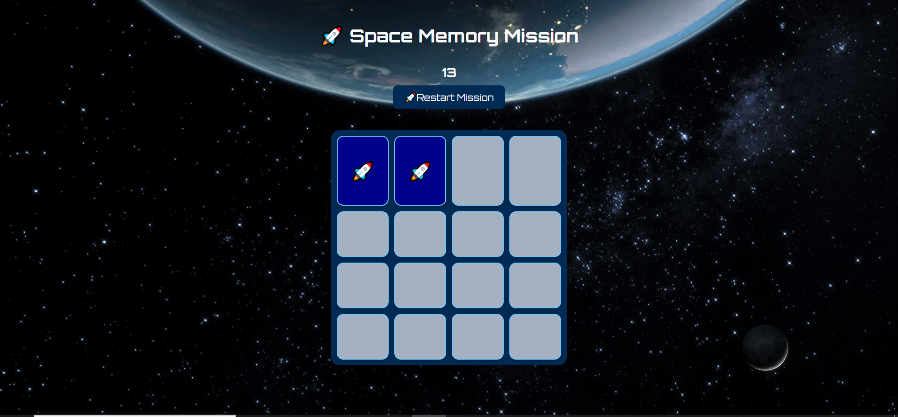

# 🚀 Space Memory Mission

## 📖 Overview

Space Memory Mission is a fun memory matching game built using **HTML**, **CSS**, and **JavaScript**. Players flip over cards to reveal space-themed emojis and try to match all pairs before the oxygen timer runs out.



---

## Features

* 🚀 Space-themed interface
* 🃏 16 memory cards (8 matching pairs)
* 🔀 Random card shuffle every game
* ⏱️ Countdown timer
* 🎉 Win message when all pairs are matched
* 💥 Lose message when time runs out
* 🔄 Restart/New Mission button
* 📖 Mission briefing with game instructions
* 🌌 Space-themed background and styling

---

## 🛠️ Technologies Used

* HTML
* CSS
* JavaScript

---

## 🎮 How to Play

1. Click a card to reveal its emoji.
2. Click a second card to find its matching pair.
3. If the cards match, they remain visible.
4. If they do not match, they flip back after a short delay.
5. Match all 8 pairs before the timer reaches zero.
6. Press **New Mission** to start a new game.

---

### Play the Game

[Deployed Game Link](http://linktoyourgame.com)

---
### Installation

No installation required! Simply clone the repository to your local machine and open the `index.html` file in your favorite browser to start playing.

```bash
git clone https://github.com/your-username/spaceman.git
cd memory-game
open index.html
```

---


## 🚀 Future Improvements

* Flip card animations
* Sound effects
* Move counter
* Space-themed card images instead of emojis

---

